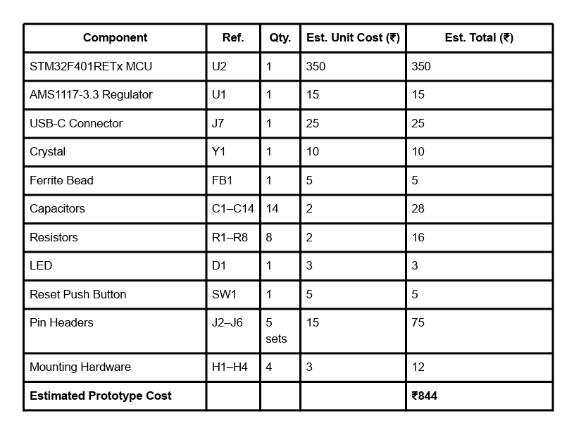

# STM32F401RETx — Custom PCB Design


> A compact, 2-layer custom PCB based on the **STM32F401RETx** microcontroller, featuring USB-C, SWD debugging, UART, SPI, I2C and GPIO expansion — designed in KiCad and fully verified with **0 DRC errors** and **0 ERC violations**.

---

## Board Preview

<p align="center">
  
</p>

<p align="center">
  
</p>

---

## Project Phases

This repository covers the complete design lifecycle:

| Phase   | Contents                                                                 | Status      |
|---------|--------------------------------------------------------------------------|-------------|
| Phase 1 | KiCad source files — schematic, PCB layout, project config               | ✅ Complete |
| Phase 2 | 3D renders, layer exports, BOM, DRC/ERC verification, design report      | ✅ Complete |

> **Phase 1** files (`STM32.kicad_sch`, `STM32.kicad_pcb`, `STM32.kicad_pro`) were uploaded in the first submission.
> **Phase 2** adds all supporting documentation, renders, and verification results — completing the full project.

---

## Repository Structure

```
STM32F401RE-Dev-Board-Design/
│
├── STM32.kicad_pcb                        # [Phase 1] KiCad PCB layout
├── STM32.kicad_pro                        # [Phase 1] KiCad project file
├── STM32.kicad_sch                        # [Phase 1] KiCad schematic
│
├── STM32_F401_Design_Report.pdf           # [Phase 2] Full design report
├── STM32_PDF.pdf                          # [Phase 2] Supplementary PDF
│
├── PCB Layout/
│   ├── STM32.zip                          # KiCad project archive
│   └── STM32_pcb_layer.zip                # Exported PCB layer files (Gerbers)
│
├── Render Images/
│   ├── STM32_img.png                      # 3D Render — Top View (clean)
│   ├── 3D Design.jpeg                     # 3D Render — KiCad Viewer Top
│   ├── IMAGE5.jpeg                        # 3D Render — PCB Back View
│   ├── IMAGE6.jpeg                        # 3D Render — Perspective View
│   ├── Layout Layer1.jpeg                 # F.Cu Front Copper Layer
│   ├── Layout Layer2.jpeg                 # B.Cu Back Copper Layer
│   ├── Schematic.jpeg                     # Full Schematic Diagram
│   ├── IMAGE1.jpeg                        # DRC Result — 0 Errors
│   └── IMAGE2.jpeg                        # ERC Result — 0 Violations
│
├── BOM/
│   ├── BOM.jpeg                           # Footprint Assignments View
│   └── BOM2.png                           # Bill of Materials Table
│
└── DRC ERC Results/
    ├── WhatsApp Image 2026-09-15 at 11.53.13 PM.jpeg     # DRC — 0 Violations
    └── WhatsApp Image 2026-09-15 at 11.53.14 PM (1).jpeg # ERC — 0 Violations
```

---

## Microcontroller

| Parameter       | Details                           |
|-----------------|-----------------------------------|
| **MCU**         | STM32F401RETx                     |
| **Package**     | LQFP-64 (10x10mm, 0.5mm pitch)    |
| **Core**        | ARM Cortex-M4 @ 84 MHz            |
| **Flash**       | 512 KB                            |
| **RAM**         | 96 KB SRAM                        |
| **EDA Tool**    | KiCad EDA 9.0.7                   |
| **PCB Layers**  | 2 (F.Cu + B.Cu)                   |

---

## Features & Connectivity

| Interface     | Connector/Ref | Description                           |
|---------------|---------------|---------------------------------------|
| **USB-C**     | J7            | USB 2.0 (USB_C_Receptacle_USB3.0_C6P)|
| **GPIO**      | J6            | 5-pin GPIO Expansion Header           |
| **SPI**       | J5            | VCC, SPI, GND Header                  |
| **UART**      | J3            | TX / RX Header                        |
| **I2C**       | J2 / J4       | SDA / SCL Header                      |
| **SWD**       | J2            | SWDIO, SWDCLK, IO, VCC, GND          |
| **RESET**     | SW1 + J4      | Tactile push button + Reset pin header|
| **Power**     | U1 (AMS1117)  | 3.3V LDO Regulator from USB 5V        |
| **Crystal**   | Y1            | 24 MHz SMD Crystal (3225-4Pin)        |
| **LED**       | D1            | Power / Status LED (0603)             |

---

## Schematic

<p align="center">
  
</p>

The schematic is divided into functional blocks:

- **STM32F401** — Central MCU with all peripheral nets routed
- **Power Supply** — AMS1117-3.3 LDO with bulk and decoupling capacitors
- **USB-C Connector** — With 5.1k CC1/CC2 pull-down resistors (R7, R8)
- **Crystal** — 24 MHz with 22pF load capacitors C12, C13
- **Header Breakouts** — UART, SPI, I2C, GPIO, SWD
- **Mounting Holes** — H1–H4 (M2.5, 2.7mm diameter)

---

## PCB Layout

### Front Copper Layer — F.Cu
<p align="center">
  
</p>

### Back Copper Layer — B.Cu
<p align="center">
  
</p>

**PCB Statistics:**

| Parameter        | Value     |
|------------------|-----------|
| Pads             | 172       |
| Vias             | 44        |
| Track Segments   | 376       |
| Nets             | 65        |
| Unrouted         | **0**     |
| Track Width      | 0.25 mm   |

---

## Bill of Materials (BOM)

<p align="center">
  
</p>

| Component              | Ref.    | Qty.   | Est. Unit Cost | Est. Total  |
|------------------------|---------|--------|----------------|-------------|
| STM32F401RETx MCU      | U2      | 1      | Rs. 350        | Rs. 350     |
| AMS1117-3.3 Regulator  | U1      | 1      | Rs. 15         | Rs. 15      |
| USB-C Connector        | J7      | 1      | Rs. 25         | Rs. 25      |
| Crystal 24 MHz         | Y1      | 1      | Rs. 10         | Rs. 10      |
| Ferrite Bead           | FB1     | 1      | Rs. 5          | Rs. 5       |
| Capacitors (0603/0805) | C1–C14  | 14     | Rs. 2          | Rs. 28      |
| Resistors (0603)       | R1–R8   | 8      | Rs. 2          | Rs. 16      |
| LED (0603)             | D1      | 1      | Rs. 3          | Rs. 3       |
| Reset Push Button      | SW1     | 1      | Rs. 5          | Rs. 5       |
| Pin Headers 2.54mm     | J2–J6   | 5 sets | Rs. 15         | Rs. 75      |
| Mounting Hardware M2.5 | H1–H4   | 4      | Rs. 3          | Rs. 12      |
| **Estimated Total**    |         |        |                | **Rs. 844** |

---

## DRC / ERC Verification

Both checks pass with **zero errors** — the design is fully clean.

### Design Rules Check (DRC) — 0 Violations

<p align="center">
  
</p>

| Check              | Result |
|--------------------|--------|
| Violations         | **0**  |
| Unconnected Items  | **0**  |
| Schematic Parity   | **0**  |

### Electrical Rules Check (ERC) — 0 Violations

<p align="center">
  
</p>

| Check    | Result |
|----------|--------|
| Errors   | **0**  |
| Warnings | **0**  |

---

## 3D Renders

<table align="center">
  <tr>
    <td align="center">
      <br/>
      <b>Top View — KiCad 3D Viewer</b>
    </td>
    <td align="center">
      <br/>
      <b>Bottom View</b>
    </td>
  </tr>
  <tr>
    <td align="center" colspan="2">
      <br/>
      <b>Perspective View</b>
    </td>
  </tr>
</table>

---

## KiCad Source Files (Phase 1)

The raw KiCad design files are at the root of this repository:

| File               | Description       |
|--------------------|-------------------|
| `STM32.kicad_pcb`  | PCB Layout        |
| `STM32.kicad_sch`  | Schematic         |
| `STM32.kicad_pro`  | KiCad Project     |

---

## Documents

| File                           | Description           |
|--------------------------------|-----------------------|
| `STM32_F401_Design_Report.pdf` | Full design report    |
| `STM32_PDF.pdf`                | Supplementary PDF     |
| `PCB Layout/STM32.zip`         | KiCad project archive |

---

## Tools Used

| Tool                | Version | Purpose                |
|---------------------|---------|------------------------|
| **KiCad EDA**       | 9.0.7   | Schematic + PCB Design |
| **KiCad 3D Viewer** | 9.0.7   | 3D Visualization       |

---


